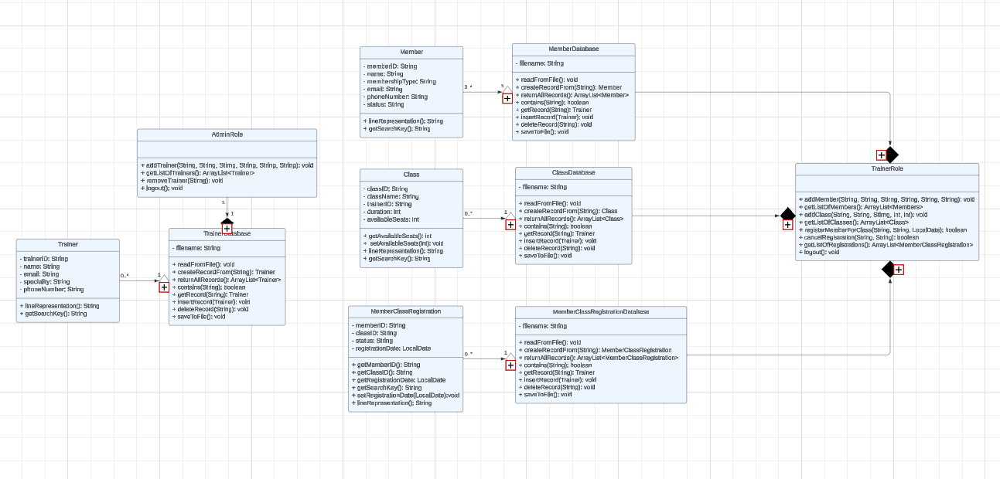

# Gym Membership Management System
## Classes:
### Admin
- Trainer
- TrainerDatabase
- AdminRole
### Trainer
- Member
- MemberDatabase
- Class
- ClassDatabase
- MemberClassRegistration
- MemberClassRegistrationDatabase
- TrainerRole

## Tasks:
- Create an initial UML diagram.
- Start implementing classes.
- Using OOP to refactoor code (Interfaces and abstraction)
- Test code

## Timeline:
- By Saturday: Finish Basic implementation of all Classes
- Sunday and Monday: Code refactoring
- Tuesday: Submission and for emergencies

## UML:
Initial Design [here](https://lucid.app/lucidchart/92c09dff-38e8-4e9b-a92a-fc9dd05b664c/edit?viewport_loc=1093%2C221%2C3804%2C1435%2CHWEp-vi-RSFO&invitationId=inv_d8d3f194-6469-426f-b898-8d274d8e8170) :

Final Design